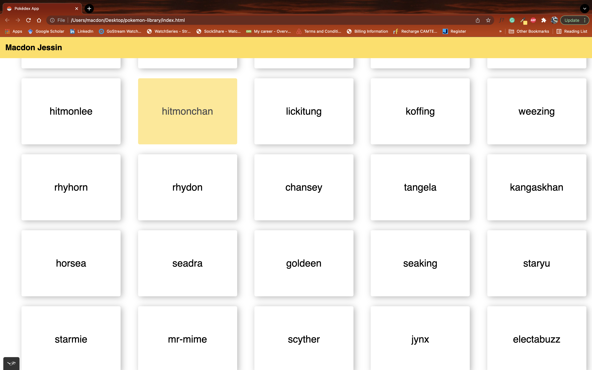

# Simple Pokemon App (Pokemon-Library)

**Project description**
The aim of this project is to build a simple Pokédex application that loads a list of  150 pokemons with a few other details like the height, weight and types.
The project is for learning purposes and therefore focuses more on the functionality while making the interface look OK.

How to get the project running
Once the page is loaded you will find a list of pokemon names. Click on any name of your choice to see more information about this pokemon.

Project dependencies
- HTML
- Custom CSS
_ Vanilla js
- jquery
- Bootstrap 4
- pokeapi (pokemon API)

Linters employed:
- W3C Linters
- Stylelint
- Es6 lint + prettier

